# Library server
This is the first part of the Library Application:
[https://github.com/florae123/LibraryApp](https://github.com/florae123/LibraryApp).

It is a java server for the Library app and requires a Cloudant NoSQL Database.

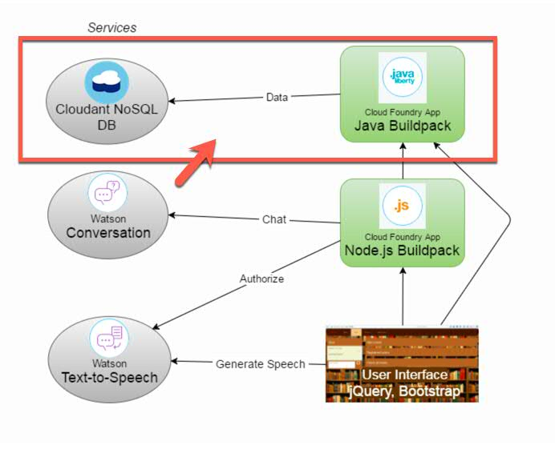

## Prerequisites

The software needed for the following steps:
* Java SE 8 (JDK),
* Eclipse Neon (another option is Maven),
* Cloud Foundry Command Line Interface ([Download here](https://github.com/cloudfoundry/cli/releases)),
* Git tool ([Download here](https://git-scm.com/downloads))

Another requirement is an IBM Bluemix Account.

## Deploy to Bluemix

1. Clone the app to your local environment from your terminal using the following command

      ```
      git clone https://github.com/florae123/library-server-java.git
      ```

    and change into the newly created directory *library-server-java*.
2.  Execute full Maven build to create the target/name.war file:

      ```
      mvn clean install
      ```

      or use Eclipse to build the Maven project:
      * Launch Eclipse, Click **File > Import**. Then select **General > Existing Projects into Workspace**. Click **Next**.
          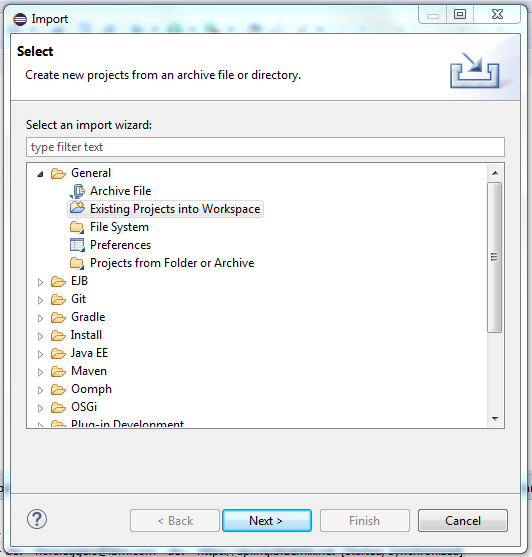
      * Choose **Select root directory** and your downloaded directory *library-server-java*.
      * Right-click your *library-server-java* project folder in Eclipse and select **Run As > Maven install**. The *.war* file will be created in the *target* directory.
          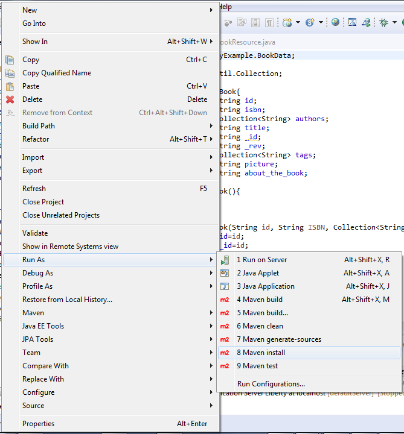

      Change into the directory *library-server-java* in your eclipse workspace directory. (This is where the target directory was created.)

3.  Verify your "Bluemix endpoint api", for example
    * US https://api.ng.bluemix.net or
    * EU-GB https://api.eu-gb.bluemix.net


     ```
     cf api https://api.ng.bluemix.net
     ```

4. Log in to your Bluemix account using the Cloud Foundry CLI tool. Provide your username and password when prompted.
      ```
      cf login
      ```

5. Push the app to Bluemix using the cf cli command
      ```
      cf push library-server -p target/library-server-java.war
      ```
6. Create an instance of the Cloudant NoSQL DB Service on Bluemix and connect it to your app.
See [Configure Databases](#configure-databases).


## Configure Databases

Create an instance of a cloudant database on Bluemix, in the same space you were using for the application.
      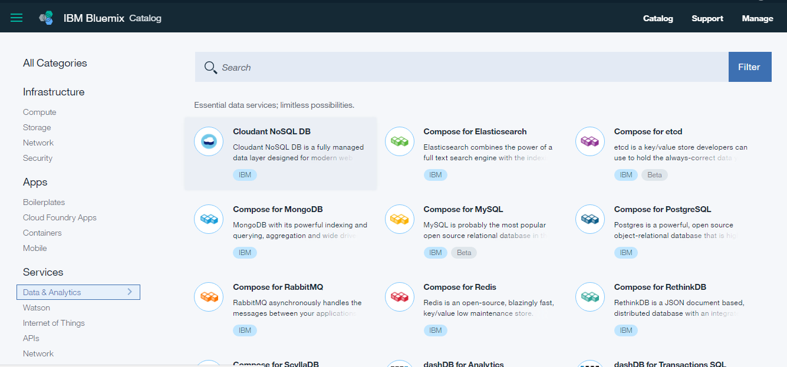
* Select **Cloudant NoSQL DB** in the Bluemix Catalog in your Browser, make sure the *Lite* pricing plan is selected and click **Create**. You will be directed to a view of the service.
* To bind this DB to the java application, open the **Connections** panel, and click **Create Connection**. Then select the java library server and click **Connect**. Restage the application when prompted.

    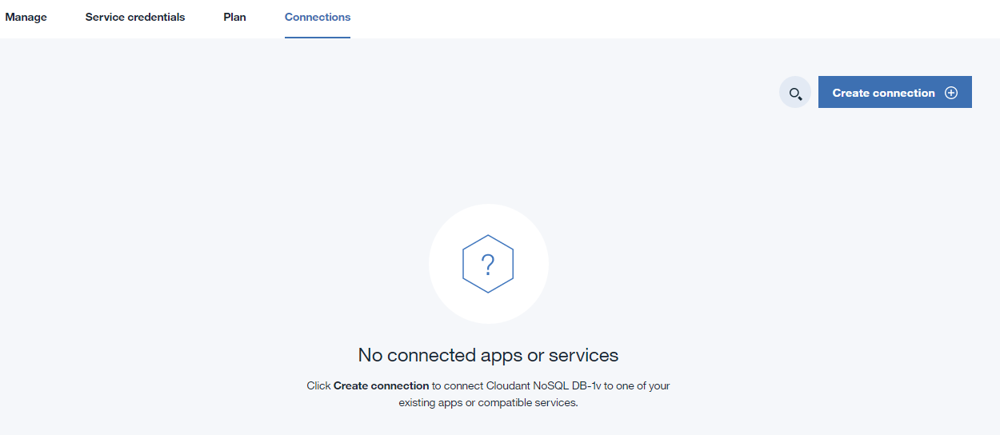

    You do not need to integrate the service credentials of the Cloudant Service instance into your code to access your databases. By connecting the service to the cloud foundry application, the app's environment variables, the **VCAP_SERVICES**, will be updated. These VCAP_SERVICES are used in the java code to retrieve the service instance's credentials.

    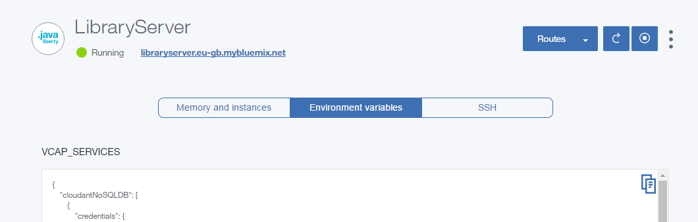

* Go back to the **Manage** panel and click **Launch**.
    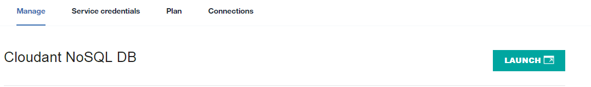

The App requires three databases in your Cloudant service.

1. Create a database called **"books"**.

    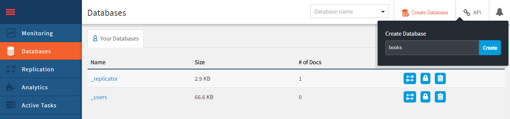

    A book will be saved as a JSON in the following format:

      ```
    	{
    	  "_id": "...",
    	  "_rev": "...",
    	  "id": "id must be the same as _id",
    	  "isbn": "the book's isbn",
    	  "authors": [
    	    "the book's author"
    	  ],
    	  "title": "bookTitle",
    	  "tags": [
    	    "Keywords", "that match", "the book"
    	  ],
    	  "picture": "the book's cover",
    	  "about_the_book": "a description to be read by Text to Speech"
    	}
      ```

    There are some sample documents in this format in the *sample-books* folder in this directory. To include any of these books in your database:
    * Click on the database **books** and then click the **+** sign next to **All Documents**.
    * Select **New Doc**.
    * Delete the default *{ "id_": "..." }* and copy the text in one of the json files into the document.
    * Click **Create Document**.

    There is no **"_rev"** attribute included in the sample json data.
    This is because the *"_rev"* attribute has to be excluded from new data that is added to a database. The Cloudant service will automatically generate the attribute-value pair *"_rev"*.

    In order for the app to be able to properly search this database, create a new search index and a new view in "books" by clicking the **"+"** sign next to "Design Documents" on the "books" database view in your Cloudant dashboard.

    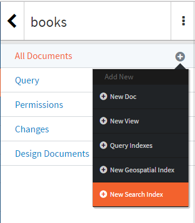

    Click **"New Search Index"** and configure the search index like this:

    * **Design Document Name:**  BookIdx
    * **Index Name:**  titleSearch
    * **Code for the search index:**
        ```
        function (doc) {
          index("default", doc.title);
        }
        ```

    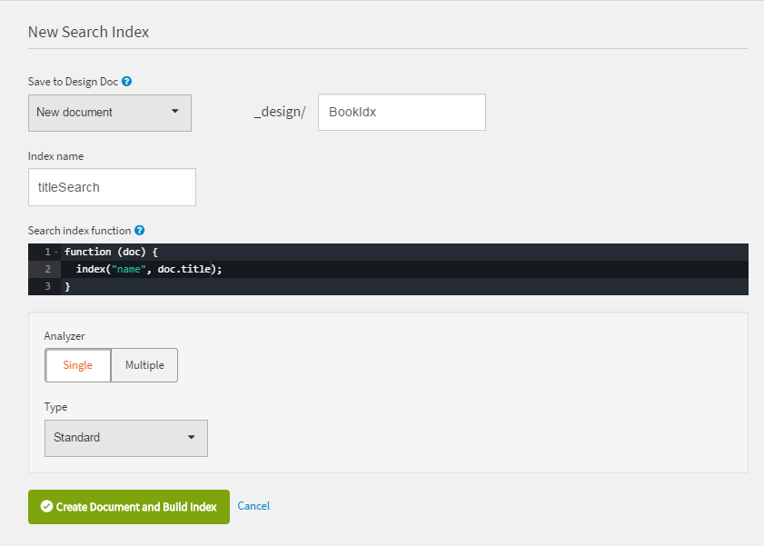

    Then, click the **"+"** sign next to "BookIdx", then click **"New View"**.

    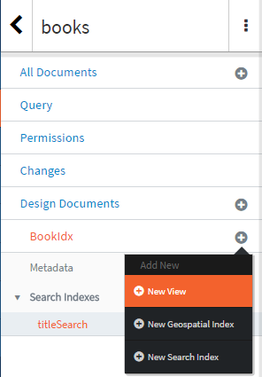

    Configure the view like this:

    * **Design Document Name:**  BookIdx
    * **View Index Name:**  tagView
    * **Code for the view:**
      ```
      function (doc) {
        var i;
        for(i in doc.tags)
           emit(doc.tags[i], doc._id);
      }
      ```

    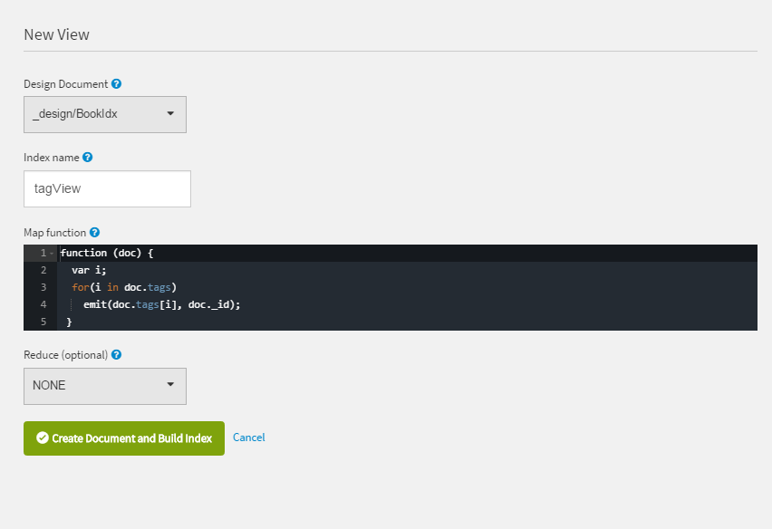

2. Create a database called **"customers"**. A customer will be saved as a JSON in the following format:

      ```
    	{
    	  "_id": "the customer's id",
        "_rev": "...",
    	  "name": "the customer's name",
    	  "email": "the customer's email address",
    	  "password": "the customer's password",
    	  "id": "must be the same as _id"
    	}
      ```

3. Create a database called **"rentals"**. Whenever a book is borrowed, it is registered in "rentals". A rental will be saved as a JSON in the following format:

      ```
      {
        "_id": "the rental's id",
        "_rev": "...",
        "id": "must be the same as _id",
        "bookid": "the id of the book borrowed",
        "customerid": "the id of the customer borrowing the book",
        "start": "Mar 3, 2017 12:00:00 AM",
        "end": "May 4, 2017 12:00:00 AM"
      }
      ```

## Test your running application

* Open the server application you just deployed to Bluemix, e.g. running on    **https://libraryserver-myname.eu-gb.mybluemix.net**.

    The text **"... Library Backend Server is running ..."** should be displayed in your browser.

    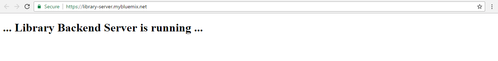

* To check the connection to the Cloudant Database, add **/api/books** to the url (e.g. **https://libraryserver-myname.eu-gb.mybluemix.net/api/books**). You should see the books that were added to your *books* database as a json array.

    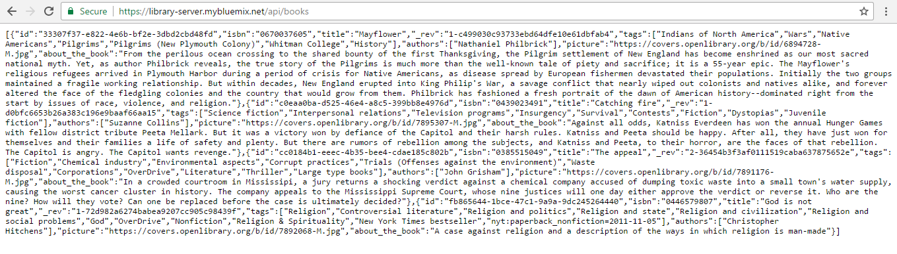
